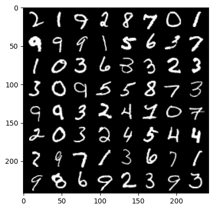
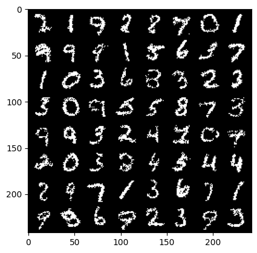

# RBM

In this repo we are going to use Restricterd Boltzman Machine(RBM) in practice, So we first implement the class of RBM and then load the MNIST datset witch is very famous dataset and mainly used for education purposes and then train the RBM model on it to generate similar images.
## original

    

## generated

    

✔️Trained model is also available as *rbm_model.pth*
